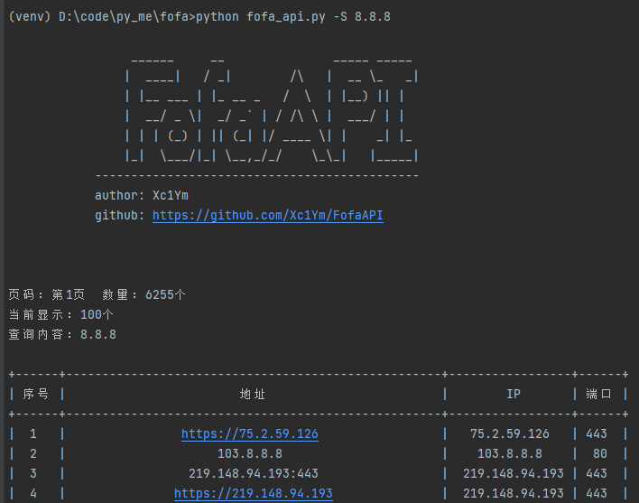
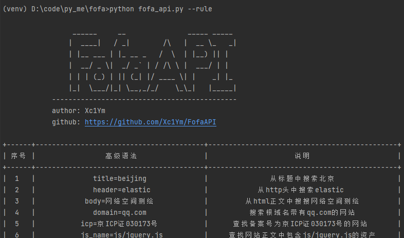

# FofaAPI
自用FofaAPI

## 使用方法

**该工具使用Fofa官方API查询，需要普通会员或高级会员**

1. 打开fofa_api.py，在第19行和20行写入你的登录邮箱和Fofa的API KEY
2. 首先安装依赖包`pip install -r requirements.txt`
3. 基础用法`python fofa_api.py -search IP\domain`
4. 帮助`python fofa_api.py -h`
5. 可以使用`--size`和`--page`设置需要查询的数量和页数
6. `--rule`可以查询Fofa支持的所有高级搜索功能

## 截图

## 开发者
[Xc1YM](https://github.com/Xc1Ym)